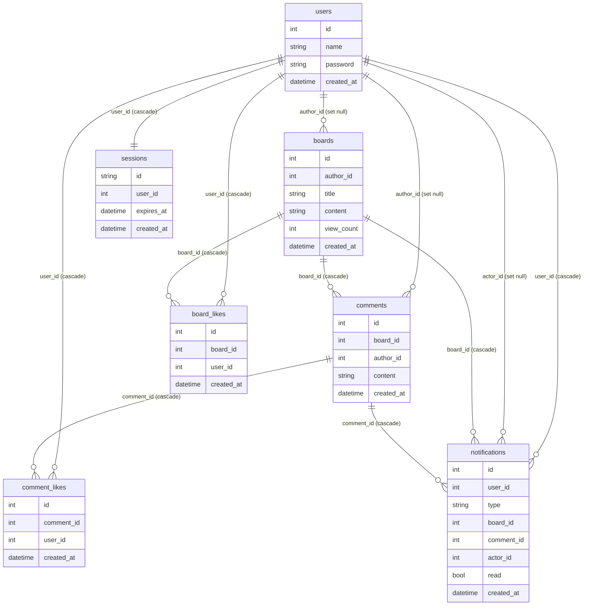

# ERD

```mermaid
erDiagram

    users {
        int id
        string name
        string password
        datetime created_at
    }

    boards {
        int id
        int author_id
        string title
        string content
        int view_count
        datetime created_at
    }

    comments {
        int id
        int board_id
        int author_id
        string content
        datetime created_at
    }

    sessions {
        string id
        int user_id
        datetime expires_at
        datetime created_at
    }

    board_likes {
        int id
        int board_id
        int user_id
        datetime created_at
    }

    comment_likes {
        int id
        int comment_id
        int user_id
        datetime created_at
    }

    notifications {
        int id
        int user_id
        string type
        int board_id
        int comment_id
        int actor_id
        bool read
        datetime created_at
    }

    users ||--o{ boards : "author_id (set null)"
    users ||--o{ comments : "author_id (set null)"
    users ||--|| sessions : "user_id (cascade)"
    users ||--o{ board_likes : "user_id (cascade)"
    users ||--o{ comment_likes : "user_id (cascade)"
    users ||--o{ notifications : "user_id (cascade)"
    users ||--o{ notifications : "actor_id (set null)"
    boards ||--o{ comments : "board_id (cascade)"
    boards ||--o{ board_likes : "board_id (cascade)"
    boards ||--o{ notifications : "board_id (cascade)"
    comments ||--o{ comment_likes : "comment_id (cascade)"
    comments ||--o{ notifications : "comment_id (cascade)"
```
